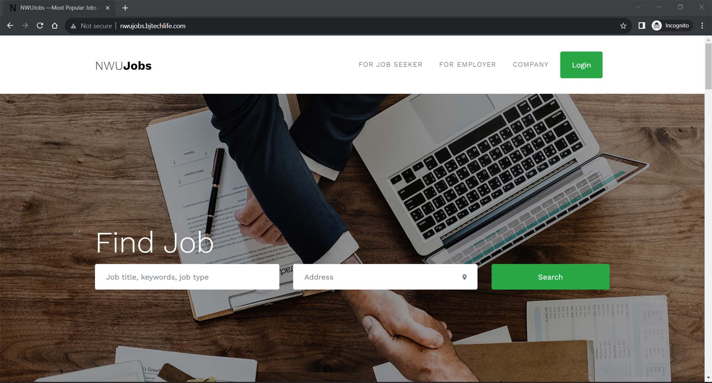

## This is a laravel 6 applaction using php7.4 & mysql for Job portal
This is a Laravel 6 application using php7.4 & MySQL for the Job portal to find a job easily. I made this project for the final year (2020) of my graduation life from North Western University (NWU), Khulna.
<br>

<p>In this scenario, there are three types of users they are <b>job seeker</b>, <b>employer</b and <b>admin</b>. All the users should be able to login to the system with separate logins. New users can be registered only under job seeker and employer. A database is there to store the user details. This information can be retrieved by the users as per their privilege. Anyone can search the jobs are updated by the website immediately using the system.</p>

<b>This application are as follows :</b>
- The applaction is for automation of Job Management System
- It provides following facilities to
  
<b>1) Employer :</b>
- Can add new job post for job seeker and update as required.
- Can update their jobs details and delete jobs data.
  
<b>2) Job Seeker :</b>
- Can apply for jobs login this website.
- Can check the updated jobs news.
- Save their favorite job
  
<b>3) Admin :</b>
- Admin is the super user who can control the application from all possible aspects.


### Udemy project Tutorial (I was making project flow through this tutorial)
https://www.udemy.com/course/make-a-job-portal-with-laravel-58-and-vue-js/
<br>
### Docker file & configuration
https://github.com/bjnandi/nwujobs-nwu-final-year-project/tree/devops
<br>
### Docker image
https://hub.docker.com/r/bjnandi/nwujobs-nwu-final-year-project
<br>
### Demo


<br><br>
<b>If you face any quarry for this project feel free to contact me. I will try my best. Thank you</b>
```
https://www.linkedin.com/in/bjnandi/
```
